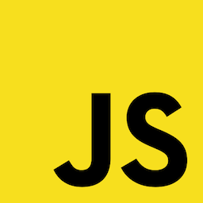
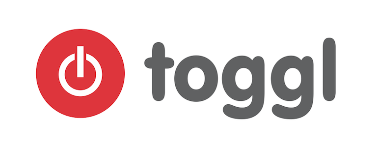

- title : Fable, the what, the why and the how
- description : Introduction to Fable, F# to JS compiler
- author : Alfonso Garcia-Caro
- theme : night
- transition : default

***

### Fable: the what, the why and the how
Bringing together the F# and JS worlds

  
     meets   
  

***

### WHO IS MAKING THIS PRESENTATION?

Alfonso Garcia-Caro

- Degree in Linguistics
- Lived in Japan, Germany (back in Spain now)
- 5 years .NET experience
- 2 years F# and JS experience
- Developed desktop, mobile and web apps for videogame,
  green energy and education industries

  
Ping me! @alfonsogcnunez

***

Working at [toggl.com](https://toggl.com), the insanely simple time tracking app

Give it a try!

***

### WHAT IS FABLE?

- F# to JS compiler
- Framework agnostic
- Plugin system
- Source maps
- Batteries charged: F# core library and some .NET BCL
- Adheres to JS standards
- Compatible with JS developments tools: [Babel](http://babeljs.io), [npm](https://www.npmjs.com), [WebPack](https://webpack.github.io)

***

### WHY FABLE?

JavaScript is evolving at rapid pace, do we need a new language?

- Static typing
- Type inference
- Whitespace indentation (optional)
- Intellisense
- REPL
- Expression based programming
- Pattern Matching
- Active Patterns
- Immutable by default
- Partial application / Pipelines
- Functional core library (LINQ on steroids!)
- List, array and iterable comprehensions
- Structural comparisons
- Observables
- String formatting
- Generics, unions, records and tuples
- Type aliases
- Custom operators
- DSL embedded in the language
- Typed-stateless Async programming
- Custom computation expressions
- OOP: Inheritance, interfaces, abstract classes
- Overloading, type extensions
- Units of measure
- Type providers (coming to Fable)
- Circular dependency restriction
- Compiler directives
- Don Syme will retweet you!

***

And the killer feature...

***

### LEFT PADDING OUT OF THE BOX!

***

### HOW DOES FABLE WORK?

***

### HOW CAN I USE FABLE?

- App boilerplate
- Hello World with Node (script)
- Console app

***

### INTERACTING WITH JS

***

### FRONT END

- TODO MVC with Vue
- Watch compilation

***

### FABLE IN NUMBERS

* Currently in beta: v0.2.0 (soon v1.0.0)
* More than 600 unit tests
* 4 months of development (but building on FunScript experience)
* 5th place after 2 months in fsprojects (Github stars)
* >300 commits, >170 stars, 12 contributors
* 6 packages in npm: compiler, core lib, bindings, TypeScript parser
* 2500 downloads last month
* 10,000 users 2016 Q4 (1)
* 1,000,000 downloads 2016 Q4 (1)

> (1) CMUF: Completely made up figures

***

### WITH F# YOU CAN DO...

- Front-end apps
- Node apps
- Native iOS & Android apps with Xamarin
- Mobile apps with Apache Cordova or React Native
- Universal Windows Platform (soon)
- Cross-platform desktop apps (Electron, .NET/Mono)
- GPU programming
- Server programming: Suave, ASP.NET
- Functional programming on .NET

***

And the final appeal...

(in case someone from Redmond is in the room)

---

### MICROSOFT, DON'T MAKE THE SAME MISTAKE AS WITH XAMARIN 

### BUY FABLE NOW AND SAVE A FEW MILLION BUCKS ;)

***

