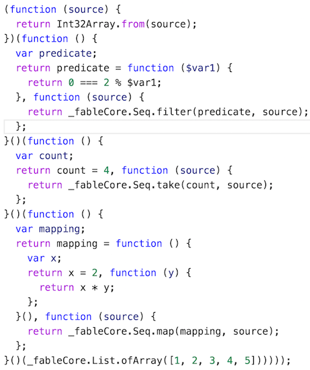
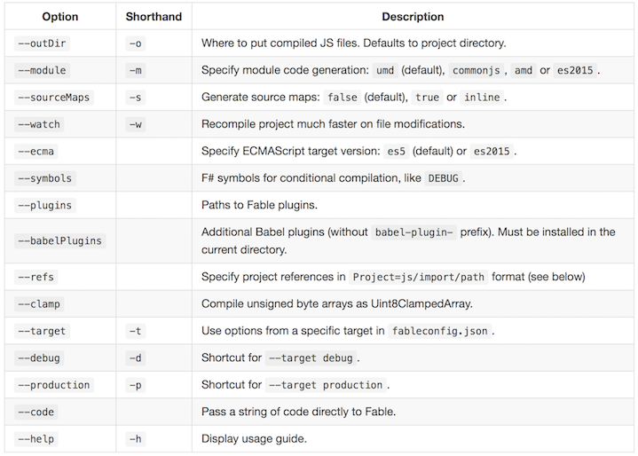

- title : Fable, the what, the why and the how
- description : Introduction to Fable, F# to JS compiler
- author : Alfonso Garcia-Caro
- theme : night
- transition : default


***


### Fable: the what, the why, the how and the where
Bringing together the F# and JS worlds

<div>
  
  <span style="white-space: pre">   meets   </span>
  
</div>


***


### **WHO** IS MAKING THIS PRESENTATION?

Alfonso Garcia-Caro

- Degree in Linguistics
- Lived in Japan, Germany (back in Spain now)
- 5 years .NET experience
- 2 years F# and JS experience
- Developed desktop, mobile and web apps for videogame,
  green energy and education industries

<div style="text-align: right">
  <p>Ping me! @alfonsogcnunez</p>
</div>


---


Working at [toggl.com](https://toggl.com), the insanely simple time tracking app

Give it a try!


***


### **WHAT** IS FABLE?

- Plain F# to JS compiler
- Batteries charged: F# core library and some .NET BCL


---


### WHAT FABLE ALLOWS YOU TO DO?

- Web front-end apps
- Node apps
- Cross-platform desktop apps (Electron, .NET/Mono)
- Mobile apps with Apache Cordova or React Native


---


### PHILOSOPHY

- No runtime
- Framework agnostic
- Generate clean JS code
- Keep file structure
- Adhere to standard JS practices: import/exports, iterables...
- Take advantage of JS development tools: bundling, hot reloading, minimification, tree shaking...


***


### **WHY** FABLE?

#### How does it compare to other F#>JS compilers?

- WebSharper: Full web development framework
- FunScript: Plain F# to JS compiler

<p class="fragment fade-in">
WebSharper plays in another league so let's focus on improvements over FunScript.
</p>

<p class="fragment fade-in">
<strong>Disclaimer:</strong> Many of the things that make Fable possible weren't available
when FunScript was developed (ES6, F# Compiler Services, Babel).
</p>


---


- F# compiler services vs quotations: no bytecode compilation, _incremental_ builds
- File import/exports vs _program soup_
- Optimizations: pipes, typed arrays
- More flexible JS interaction
- Source maps: F# code debugging
- [Plugin system](https://github.com/fsprojects/Fable/blob/master/docs/plugins.md)

<p class="fragment fade-in">
And the killer feature...
</p>


---


### LEFT PADDING OUT OF THE BOX!

    // Explicit
    "3.14".PadLeft(10)                    // "      3.14"
    "3.14".PadRight(10)                   // "3.14      "
    "22".PadLeft(10, '0')                 // "0000000022"

    // With .NET string formatting
    String.Format("{0,10:F1}", 3.14)      // "       3.1"
    String.Format("{0,-10:F1}", 3.14)     // "3.1       "

    // With F# typed string formatting
    sprintf "%10.1f" 3.14                 // "       3.1"
    sprintf "%-10.1f" 3.14                // "3.1       "
    sprintf "%+010i" 22                   // "+000000022"

***


#### PIPING: NOT OPTIMIZED




---


#### PIPING: OPTIMIZED

```fsharp
[1; 2; 3; 4; 5]
|> Seq.map ((*) 2)
|> Seq.take 4
|> Seq.filter ((%) 2 >> (=) 0)
|> Seq.toArray
```

```js
var _fableCore = require("fable-core");

Int32Array.from(_fableCore.Seq.filter(function ($var1) {
return 0 === 2 % $var1;
}, _fableCore.Seq.take(4, _fableCore.Seq.map(function () {
var x;
return x = 2, function (y) {
    return x * y;
};
}(), _fableCore.List.ofArray([1, 2, 3, 4, 5])))));
```

***
- data-transition:zoom


### **HOW** DOES FABLE WORK?

This is what a day in the life of a compiler looks like:

<ol>
<li>Parse and validate text into an Abstract Syntax Tree</li>
<li>Make necessary transformations on that AST</li>
<li>Generate new code from the AST: assembly, bytecode, JS...</li>
</ol>


---
- data-transition:zoom


As Fable works with known languages it can take advantage
of existing tools.

F# compiler, like Roslyn, can be used as a service:
we completed the first step **for free**!

Unfortunately JS is not a compiled language

<p class="fragment fade-in">
...or is it?
</p>


---
- data-transition:zoom


Enter Babel

---
- data-transition:zoom


Babel generates an AST from ES2015 code,
applies transformations with a pluggable system
and generates ES5 JavaScript code.


---
- data-transition:zoom


Fable builds a bridge between F# and Babel AST
delegating the reponsibility of code parsing and generation.


---
- data-transition:zoom


Fable adds its own AST for internal operations:

- [Optimizations](https://github.com/fsprojects/Fable/blob/master/src/fable-fsharp/FSharp2Fable.fs)
- [Call replacement](https://github.com/fsprojects/Fable/blob/master/src/fable-fsharp/Replacements.fs)
- [Plugin system](https://github.com/fsprojects/Fable/blob/master/docs/plugins.md)


***


### **HOW** CAN I USE FABLE?

Fable can be downloaded from [npm](https://www.npmjs.com/package/fable-compiler)

    [lang=shell]
    mkdir temp
    cd temp
    npm init --yes
    npm install -g fable-compiler
    npm install --save fable-core
    echo "printfn \"Hello World\"" > hello.fsx
    fable hello.fsx
    node hello.js


---


### Compiler options

[Tailor compilation](https://github.com/fsprojects/Fable/blob/master/docs/compiling.md#cli-options) to your needs:



---


### [fableconfig.json](https://github.com/fsprojects/Fable/blob/master/docs/compiling.md#fableconfigjson)

    [lang=json]
    {
        "module": "commonjs",
        "outDir": "out",
        "sourceMaps": true,
        "projFile": "src/Fable.Samples.React.fsproj",
        "babelPlugins": ["transform-runtime"],
        "scripts": {
            "prebuild": "npm install",
            "postbuild": "node node_modules/webpack/bin/webpack"
        },
        "targets": {
            "debug": {
                "watch": true,
                "symbols": ["DEBUG"],
                "scripts": {
                    "postbuild": "node out/server"
                }
            }
        }
    }


---


### DEMO

Console application

https://github.com/fsprojects/Fable/blob/master/samples/node/console/index.fs


---


### TESTING

NUnit or Visual Studio tests can be compiled to JS too

    #r "../../../packages/NUnit/lib/nunit.framework.dll"
    #load "util/util.fs"

    open NUnit.Framework

    [<Test>]
    let ``Util.reverse works``() =
        let res = Util.reverse "yllihP"
        Assert.AreEqual("Philly", res)


---

Compile the tests using NUnit plugin and run them with Mocha

    [lang=text]
    fable samples/node/console/tests.fsx -m commonjs
        --outDir out --plugins build/plugins/Fable.Plugins.NUnit.dll

    node build/tests/node_modules/mocha/bin/mocha
        samples/node/console/out/tests.js

***
- data-transition:concave


### INTERACTING WITH JS

We don't want to just intrude the JS ecosytem,
we want to take advantage of its full potential.

<p class="fragment fade-in">
Because .NET community is <strong>great</strong>
</p>

<p class="fragment fade-in">
F# community is <strong>fantastic</strong>
</p>

<p class="fragment fade-in">
JS community is...
</p>

<p class="fragment fade-in" style="font-size: 6em">
<strong>HUGE</strong>
</p>

<p class="fragment fade-in">
...and amazing too :)
</p>


---
- data-transition:concave


### DYNAMIC PROGRAMMING WITH FABLE

    open Fable.Core

    printfn "Value: %O" jsObj?myProp    // Property access

    jsObj?myProp <- 5                   // Assignment

    let x = jsObj?myMethod $ (1, 2)     // Application

    let y = createNew jsCons (1, 2)     // Apply `new` keyword

    let data =                          // JS literal object
        createObj [
            "todos" ==> Storage.fetch()
            "newTodo" ==> ""
            "editedTodo" ==> None
            "visibility" ==> "all"
        ]


---
- data-transition:concave


### JS MACROS

Use `Emit` attribute to emit JS code directly

    open Fable.Core

    [<Emit("$0 + $1")>]
    let add (x: int) (y: string): float = failwith "JS only"

    type Test() =
        // Rest arguments
        [<Emit("$0($1...)")>]
        member __.Invoke([<ParamArray>] args: int[]): obj =
            failwith "JS only"

        // Syntax conditioned to optional parameter
        [<Emit("$0[$1]{{=$2}}")>]
        member __.Item
            with get(): float = failwith "JS only"
            and set(v: float): unit = failwith "JS only"


---
- data-transition:concave


### SPECIAL ATTRIBUTES

- Erased Union Types
- String Literal Types
- Key-Value Lists

```fsharp
[<Erase>]
type MyErasedType =
    | String of string | Number of int

[<StringEnum>]
type MyStrings =
    | Vertical | Horizontal

[<KeyValueList>]
type MyOptions =
    | Flag1 | Name of string | [<CompiledName("QTY")>] QTY of int
```

---
- data-transition:concave


### FOREIGN INTERFACES

Define foreign interfaces easily to get the benefits of static checking and Intellisense

    [<Import("*","string_decoder")>]
    module string_decoder =
        type NodeStringDecoder =
            abstract write: buffer: Buffer -> strings
            abstract detectIncompleteChar: buffer: Buffer -> float

        let StringDecoder: NodeStringDecoder = failwith "JS only"


Use `Import` attribute to [import external JS modules in ES2015 fashion](https://github.com/fsprojects/Fable/blob/master/docs/interacting.md#import-attribute)

---
- data-transition:concave
- class:line-height-150


- Native JS, Browser and Node interfaces are included in [fable-core](https://www.npmjs.com/package/fable-core)
- More definitions can be found in npm: [fable-import-xxx](https://www.npmjs.com/search?q=fable-import)
- A TypeScript parser (still in development) is also available: [ts2fable](https://www.npmjs.com/package/ts2fable) 


***

### DEMO

Node static server

https://github.com/fsprojects/Fable/blob/master/samples/node/server/index.fsx

---

### DEMO

Debugging a [node express server](https://github.com/fsprojects/Fable/blob/master/samples/node/express/index.fsx) with [VS Code](http://code.visualstudio.com/docs/editor/debugging)

    [lang=json]
    {
        "name": "Launch Node",
        "type": "node",
        "request": "launch",
        "program": "${workspaceRoot}/samples/node/express/index.fsx",
        "outDir": "${workspaceRoot}/samples/node/express/out",
        "sourceMaps": true,
    }


---


### DEMO

Front end applications with JS frameworks: [Vue](http://vuejs.org), [React](http://facebook.github.io/react/)

https://github.com/fsprojects/Fable/tree/master/samples/browser/todomvc

https://github.com/fsprojects/Fable/tree/master/samples/browser/react


***


### WHERE IS FABLE HEADING? ROADMAP

- Release v1.0.0
- Improve TypeScript parser
- Bring back online REPL
- Integration with Ionide
- Integration with FSLab
- More elaborated examples, tutorials
- Target TypeScript 2.0 in future releases?


***


### FABLE IN NUMBERS

- Currently in beta: [v0.2.10](https://www.npmjs.com/package/fable-compiler) (soon v1.0.0)
- >600 [unit tests](https://github.com/fsprojects/Fable/tree/master/src/tests)
- >800 lines of [documentation](https://github.com/fsprojects/Fable/tree/master/docs)
- >4500 lines of code of [compiler core](https://github.com/fsprojects/Fable/tree/master/src/fable-fsharp)
- >300 commits, >200 stars, 12 contributors
- 6 packages in [npm](https://www.npmjs.com/~alfonsogarciacaro): compiler, core lib, bindings, TypeScript parser
- 2500 downloads last month
- 10,000 users 2016 Q4 (1)
- 1,000,000 downloads 2016 Q4 (1)

> (1) CMUF: Completely made up figures


***

### Thanks for listening!

Questions?

https://github.com/fsprojects/Fable

@alfonsogcnunez