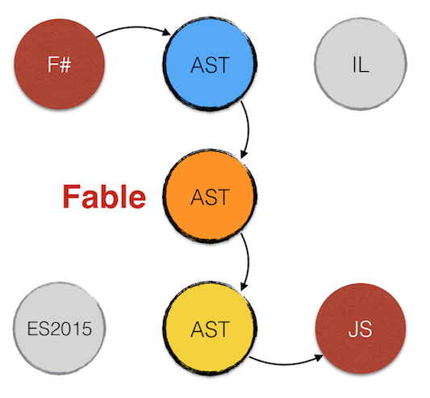

- title : Fable, the what, the why and the how
- description : Introduction to Fable, F# to JS compiler
- author : Alfonso Garcia-Caro
- theme : night
- transition : default

***

### Fable: the what, the why and the how
Bringing together the F# and JS worlds

  
     meets   
  

***

### **WHO** IS MAKING THIS PRESENTATION?

Alfonso Garcia-Caro

- Degree in Linguistics
- Lived in Japan, Germany (back in Spain now)
- 5 years .NET experience
- 2 years F# and JS experience
- Developed desktop, mobile and web apps for videogame,
  green energy and education industries

  
Ping me! @alfonsogcnunez

---

Working at [toggl.com](https://toggl.com), the insanely simple time tracking app

Give it a try!

***

### **WHAT** IS FABLE?

- F# to JS compiler
- Framework agnostic
- Plugin system
- Source maps
- Batteries charged: F# core library and some .NET BCL

---

### NOT AND AD-HOC LANGUAGE

- F# is a general purpose language mainly targeting .NET
- Not crafted specifically to compile to JS, like Dart, TypeScript or Elm
- Allows you to reuse your knowledge: **semantics**, **tooling** and **APIs**

---

### BUT BEHAVES LIKE ONE

- No runtime
- Compiles to clean JS code
- Great interoperability with JS libraries
- Adheres to standard practices and workflows
- Compatible with JS developments tools: [Babel](http://babeljs.io), [npm](https://www.npmjs.com), [WebPack](https://webpack.github.io)

***

### **WHY** FABLE?

#### JavaScript is evolving at rapid pace, do we need a new language?

ES2015 adds many great features and JS development tools keep getting better and better

But there are still things some programmers miss:

<ul>
<li>Static typing</li>
<li>Great editor support out of the box</li>
<li>Comprehensive core library</li>

F# brings this and a couple more features...

---
- class: line-height-150

- REPL
- Intellisense
- Type inference
- Custom operators
- Whitespace indentation (optional)
- Expression based programming
- Pattern Matching
- Active Patterns
- Immutable by default
- Partial application / Pipelines
- Functional core library (LINQ on steroids!)

---
- class: line-height-150

- Observables
- String formatting
- Structural comparison
- List, array and iterable comprehensions
- Generics, unions, records and tuples
- Type aliases
- DSL embedded in the language
- Typed-stateless Async programming

---
- class: line-height-150

- OOP: Inheritance, interfaces, abstract classes
- Custom computation expressions
- Overloading, type extensions
- Type providers (coming to Fable)
- Units of measure
- Circular dependency restriction
- Compiler directives
- An excuse for being condescendant with non-functional programming
- Don Syme retweeting you!

And the killer feature...

---

### LEFT PADDING OUT OF THE BOX!

    // Explicit
    "3.14".PadLeft(10)                    // "      3.14"
    "3.14".PadRight(10)                   // "3.14      "
    "22".PadLeft(10, '0')                 // "0000000022"

    // With .NET string formatting
    String.Format("{0,10:F1}", 3.14)      // "       3.1"
    String.Format("{0,-10:F1}", 3.14)     // "3.1       "

    // With F# typed string formatting
    sprintf "%10.1f" 3.14                 // "       3.1"
    sprintf "%-10.1f" 3.14                // "3.1       "
    sprintf "%+010i" 22                   // "+000000022"

***
- data-transition:zoom

### **HOW** DOES FABLE WORK?

This is what a day in the life of a compiler looks like:

<ol>
<li>Parse and validate text into an Abstract Syntax Tree</li>
<li>Make necessary transformations on that AST</li>
<li>Generate new code from the AST: assembly, bytecode, JS...</li>
</ol>

---
- data-transition:zoom

As Fable works with known languages it can take advantage
of existing tools.

F# compiler, like Roslyn, can be used as a service:
we completed the first step **for free**!

Unfortunately JS is not a compiled language

...or is it?

---
- data-transition:zoom

Enter Babel

---
- data-transition:zoom

Babel generates an AST from ES2015 code,
applies transformations with a pluggable system
and generates ES5 JavaScript code.

---
- data-transition:zoom

Fable builds a bridge between F# and Babel AST
delegating the reponsibility of code parsing and generation.

---
- data-transition:zoom

Fable adds its own AST for internal operations:

- Optimizations
- Call replacement
- Plugin system

***

### **HOW** CAN I USE FABLE?

Hello World

    [lang=shell]
    mkdir temp
    cd temp
    npm init --yes
    npm install -g fable-compiler
    npm install --save fable-core
    echo "printfn \"Hello World\"" > hello.fsx
    fable hello.fsx
    node hello.js

---

### DEMO

Console application

---

### TESTING

NUnit or Visual Studio tests can be compiled to JS too

    #r "../../../packages/NUnit/lib/nunit.framework.dll"
    #load "util/util.fs"

    open NUnit.Framework

    [<Test>]
    let ``Util.reverse works``() =
        let res = Util.reverse "yllihP"
        Assert.AreEqual("Philly", res)

---

Compile the tests using NUnit plugin and run them with Mocha

    [lang=text]
    fable samples/node/console/tests.fsx -m commonjs
        --outDir out --plugins build/plugins/Fable.Plugins.NUnit.dll

    node build/tests/node_modules/mocha/bin/mocha
        samples/node/console/out/tests.js

***
- data-transition:concave

### INTERACTING WITH JS

We don't want to just intrude the JS ecosytem,
we want to take advantage of its full potential.

Because .NET community is <strong>great</strong>

F# community is <strong>fantastic</strong>

JS community is...

<strong>HUGE</strong>

...and amazing too :)

---
- data-transition:concave

### DYNAMIC PROGRAMMING WITH FABLE

    open Fable.Core

    printfn "Value: %O" jsObj?myProp    // Property access

    jsObj?myProp <- 5                   // Assignment

    let x = jsObj?myMethod $ (1, 2)     // Application

    let y = createNew jsCons (1, 2)     // Apply `new` keyword

    let data =                          // JS literal object
        createObj [
            "todos" ==> Storage.fetch()
            "newTodo" ==> ""
            "editedTodo" ==> None
            "visibility" ==> "all"
        ]

---
- data-transition:concave

### JS MACROS

Use `Emit` attribute to emit JS code directly

    open Fable.Core

    [<Emit("$0 + $1")>]
    let add (x: int) (y: string): float = failwith "JS only"

    type Test() =
        // Rest arguments
        [<Emit("$0($1...)")>]
        member __.Invoke([<ParamArray>] args: int[]): obj =
            failwith "JS only"

        // Syntax conditioned to optional parameter
        [<Emit("$0[$1]{{=$2}}")>]
        member __.Item
            with get(): float = failwith "JS only"
            and set(v: float): unit = failwith "JS only"

---
- data-transition:concave

### FOREIGN INTERFACES

Define foreign interfaces easily to get the benefits of static checking and intellisense.

    [<Import("*","string_decoder")>]
    module string_decoder =
        type NodeStringDecoder =
            abstract write: buffer: Buffer -> strings
            abstract detectIncompleteChar: buffer: Buffer -> float

        let StringDecoder: NodeStringDecoder = failwith "JS only"

Use `Import` attribute to import external JS modules in ES2015 fashion.

---
- data-transition:concave
- class:line-height-150

- Native JS, Browser and Node interfaces are included in `fable-core` package
- More definitions can be found in npm: `fable-import-***`
- A TypeScript parser (still in development) is available in npm: `ts2fable` 

***

### DEMO

Front end applications with JS frameworks: [Vue](http://vuejs.org), [React](http://facebook.github.io/react/)

***

### FABLE IN NUMBERS

- Currently in beta: v0.2.1 (soon v1.0.0)
- >600 unit tests
- >800 lines of documentation
- >4500 lines of code of compiler core
- 4 months of development (but building on FunScript experience)
- 5th place after 2 months in fsprojects (Github stars)
- >300 commits, >170 stars, 12 contributors
- 6 packages in npm: compiler, core lib, bindings, TypeScript parser
- 2500 downloads last month
- 10,000 users 2016 Q4 (1)
- 1,000,000 downloads 2016 Q4 (1)

> (1) CMUF: Completely made up figures

***

### SO WITH F# NOW YOU CAN DO...

- Front-end apps
- Node apps
- Native iOS & Android apps with Xamarin
- Mobile apps with Apache Cordova or React Native
- Universal Windows Platform (soon)
- Cross-platform desktop apps (Electron, .NET/Mono)
- Server programming: Suave, ASP.NET
- GPU programming
- Functional programming on .NET

***

And the final appeal...

(In case someone from Redmond is in the room)

<h4 class="fragment fade-in">
MICROSOFT, don't make the same mistake as with Xamarin
</h4>

<h3 class="fragment fade-in">
Buy Fable now and save a few million bucks ;)
</h3>

***

### Thanks for listening!

Questions?

https://github.com/fsprojects/Fable

@alfonsogcnunez